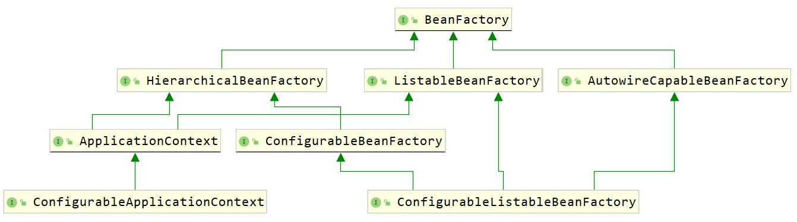

# spring-study
Spring日常学习

&emsp;&emsp;IOC 控制反转是一种思想，它的核心是将控制权转交出去。利用 IOC 思想，可以实现组件之间的解耦。IOC 的实现方式通常有依赖注入和依赖查找。

&emsp;&emsp;依赖注入:

- setter注入
- 构造器注入
- 参数注入
- 属性注入

&emsp;&emsp;自动注入注解:

- @Autowired 按类型注入/
- @Resource 按名称注入/
- @Inject 按类型注入/

**BeanFactory类继承关系图**

**ApplicationContext类(SpringFramework最核心接口)继承关系图**

继承关系图.png)

- 基于xm配置的ClassPathXmlApplicationContext和FileSystemXmlApplicationContext
- 基于注解启动的AnnotationConfigApplicationContext

- 模块装配:自定义注解 + @Import 导入组件

>导入配置类、ImportSelector 的实现类
ImportBeanDefinitionRegistrar 的实现类或者普通类

- 模块装配/条件装配/SPI

&emsp;&emsp;SPI 全称叫 Service Provider Interface 服务提供接口，它可以通过一个指定的接口 / 抽象类，寻找到预先配置好的实现类（并创建实现类对象）。
SpringFramework 的 SPI 文件也是有规矩的，它需要放在工程的 META-INF 下，且文件名必须为 spring.factories 。

&emsp;&emsp;BeanDefinitionRegistry中存放了所有BeanDefinition,BeanDefinitionRegistry的主要实现是DefaultListableBeanFactory.

&emsp;&emsp;BeanPostProcessor 是一个容器的扩展点，它可以在 bean 的生命周期过程中，初始化阶段前后添加自定义处理逻辑，并且不同 IOC 容器间的 BeanPostProcessor 不会相互干预。

&emsp;&emsp;BeanDefinitionRegistryPostProcessor 的执行时机比 BeanFactoryPostProcessor 更早，BeanFactoryPostProcessor 一般只用来修改、扩展 BeanDefinition 中的信息，
而 BeanDefinitionRegistryPostProcessor 则可以在 BeanFactoryPostProcessor 处理 BeanDefinition 之前，向 BeanFactory 注册新的 BeanDefinition ，
甚至注册新的 BeanFactoryPostProcessor 用于下一个阶段的回调。

&emsp;&emsp;后置处理器:

- BeanPostProcessor-bean实例
- BeanFactoryPostProcessor-BeanDefinition
- BeanDefinitionRegistryPostProcessor-BeanDefinition 、.class 文件等

&emsp;&emsp;单例bean生命周期

AbstractApplicationContext-refresh

- BeanDefinition 部分
- BeanDefinition 的解析
- BeanDefinition 的注册
- bean 实例部分
- bean 的实例化
- bean 的属性赋值 + 依赖注入
- bean 的初始化流程
- bean 的启动与停止(Lifecycle)
- bean 的销毁

